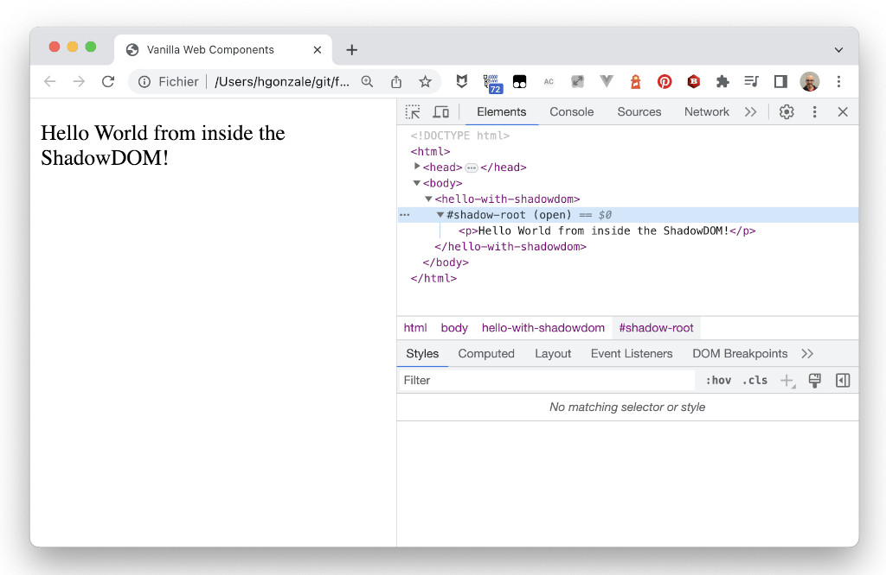

# Web Components in 2023 - Vanilla Custom Elements


> In computer science, vanilla describes software, hardware or algorithms that have not been customized or modified from their original form.
> Wikipedia

Vanilla Custom Elements are Custom Elements built using only the standard HTML, CSS & JavaScript shipped in modern browsers, without depending of any external library.

In this section we are working with Custom Elements that use the standard as it is.

## A *Hello world* Custom Elements

We can define a new Custom Elements by extending the `HTMLElement` class:


File `src/hello-world.js`
```javascript
class HelloWorld extends HTMLElement {
    
  // This gets called when the HTML parser sees your tag
  constructor() {
    super(); // always call super() first in the ctor.
    this.msg = 'Hello World!';
  }
  // Called when your element is inserted in the DOM or
  // immediately after the constructor if it’s already in the DOM
  connectedCallback() {
    this.innerHTML = `<p>${this.msg}</p>`;
  }
}

customElements.define('hello-world', HelloWorld);
```

And to use it, we simply load the JS file to get the Custom Element definition and we can use it as any other HTML tag:


File `src/index.html`
```html
<!DOCTYPE html>
<html>
  <head>
    <title>Vanilla Web Components</title>
    <script src="./hello-world.js"></script>
  </head>
  <body>
    <hello-world></hello-world>
  </body>
</html>
```

And we can simply open it in the browser, as no build process needed, all is fully native browser web standard:

[](./img/hello-world.png)

In this example we are using the `connectedCallback` lifecycle callback to fill in the custom element with `<p>Hello World!</p>`. `connectedCallback` isn't the only lifecycle callback available in a Custom Element, there are 3 others.


## Lifecycle callbacks

There are 4 different lifecycle callbacks built-in the Custom Element definition:

- `connectedCallback`: Invoked each time the custom element is appended into a document-connected element. This will happen each time the node is moved, and may happen before the element's contents have been fully parsed.

- `disconnectedCallback`: Invoked each time the custom element is disconnected from the document's DOM.

- `adoptedCallback`: Invoked each time the custom element is moved to a new document.

- `attributeChangedCallback`: Invoked each time one of the custom element's attributes is added, removed, or changed. Which attributes to notice change for is specified in a `static get observedAttributes` method

Let's create a Custom Element to show all these callbacks:


File `src/hello-lifecycle-callbacks.js`
```javascript
class HelloLifecycleCallbacks extends HTMLElement {
  constructor() {
    // Called when an instance of the element is created or upgraded
    super(); // always call super() first in the ctor.
  }
  // Tells the element which attributes to observer for changes
  // This is a feature added by Custom Elements
  static get observedAttributes() {
    return [ `hello` ];
  }
  connectedCallback() {
    // Called every time the element is inserted into the DOM
    console.log(`Hello from HelloLifecycleCallbacks connectedCallback()`);
  }
  disconnectedCallback() {
    // Called every time the element is removed from the DOM. 
    console.log(`Hello from HelloLifecycleCallbacks disconnectedCallback()`);
  }
  attributeChangedCallback(attrName, oldVal, newVal) {
    // Called when an attribute was added, removed, or updated
    console.log(`Hello from HelloLifecycleCallbacks attributeChangedCallback()`);
    console.log(`Changed attribute: ${attrName}, old value: ${oldVal}, new value: ${newVal}`);
  }
  adoptedCallback() {
    // Called if the element has been moved into a new document
    console.log(`Hello from HelloLifecycleCallbacks adoptedCallback()`);
  }
}

customElements.define('hello-lifecycle-callbacks', HelloLifecycleCallbacks);
```

And let's add a HTML file that loads the element, and modifies the `hello` attribute:


File `src/index.html`
```html
<!DOCTYPE html>
<html>
  <head>
    <title>Vanilla Web Components</title>
    <script src="./hello-lifecycle-callbacks.js"></script>
  </head>
  <body>
    
    <hello-lifecycle-callbacks id="lifecycle-callbacks"></hello-lifecycle-callbacks>

    <script>
      document.getElementById('lifecycle-callbacks')
        .setAttribute('hello', 'World with Lifecycle Callbacks!');
    </script>
  </body>
</html>
```

And we can test on the browser:

[](./img/hello-lifecycle-callbacks.png)


## ShadowDOM

The ShadowDOM is one of the most powerful and at the same time less understood part of the Custom Element standard.

Lets begin with a small example:


File `src/hello-with-shadowdom`
```javascript
class HelloWithShadowdom extends HTMLElement {
    
  // This gets called when the HTML parser sees your tag
  constructor() {
    super(); // always call super() first in the ctor.
    this.msg = 'Hello from inside the ShadowDOM!';
    this.attachShadow({ mode: 'open' });
  }
  // Called when your element is inserted in the DOM or
  // immediately after the constructor if it’s already in the DOM
  connectedCallback() {
    this.shadowRoot.innerHTML = `<p>${this.msg}</p>`;
  }
}

customElements.define('hello-with-shadowdom', HelloElementWithShadowdom);
```

And let's add a HTML file that loads the element:

File `src/index.html`
```html
<!DOCTYPE html>
<html>
  <head>
    <title>Vanilla Web Components</title>
    <script src="./hello-with-shadowdom.js"></script>
  </head>
  <body>
    
    <hello-with-shadowdom></hello-with-shadowdom>

  </body>
</html>
```

And we can test on the browser:

[](./img/hello-with-shadowdom.png)


## Templates

In this first examples, we aren't using templates, we are directly injecting the HTML inside the Custom Element. Let's modify our `hello-with-shadowdom` to make it use a template:

File: `src/hello-with-template`
```javascript
class HelloWithTemplate extends HTMLElement {
    
  // This gets called when the HTML parser sees your tag
  constructor() {
    super(); // always call super() first in the ctor.
    this.template = document.createElement('template');
    this.template.innerHTML = `
        <p>Hello <slot></slot> with templates!</p>
    `;
    this.attachShadow({ mode: 'open' });
  }
  // Called when your element is inserted in the DOM or
  // immediately after the constructor if it’s already in the DOM
  connectedCallback() {
    let templateContent = this.template.content;
    this.shadowRoot.appendChild(templateContent.cloneNode(true));
  }
}

customElements.define('hello-with-template', HelloWithTemplate);
```


And let's add a HTML file that loads the element:

File `src/index.html`
```html
<!DOCTYPE html>
<html>
  <head>
    <title>Vanilla Web Components</title>
    <script src="./hello-with-template.js"></script>
  </head>
  <body>
    <hello-with-template>World</hello-with-template>
  </body>
</html>
```

And we can test on the browser:

[](./img/hello-with-template.png)

