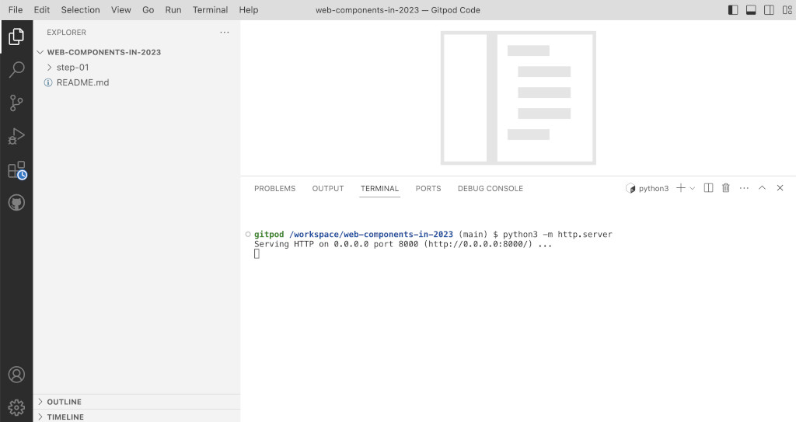

# Web Components in 2023 - Vanilla `my-counter` Element

For most of the examples in this workshop, we are going to build the same element in very different ways. The element is a very simple counter, that can be increased using a button.


Let's see the vanilla version of `my-counter`:

File `src/my-vanilla-counter.js`

```javascript

```
To use it, we simply load the JS file as a module, as it has an asset (the logo image) that need to get grabbed. And then, as usual we can use it as any other HTML tag:

File `index.html`
```html
<!DOCTYPE html>
<html>
  <head>
    <title>Vanilla `my-counter`</title>
    <script type="module" src="./src/my-vanilla-counter.js"></script>
  </head>
  <body>
    <h1><code>my-vanilla-counter</code></h1>
    <my-vanilla-counter></my-vanilla-counter>
  </body>
</html>
```

As before, no build process is needed, all is fully native browser web standard. But this time, we are using imports, we can't simply open the file in the browser, we need to launch a web server.

> If you're [running the workshop on GitPod](https://gitpod.io/#https://github.com/LostInBrittany/web-components-in-2023.git), simply execute a Python Simple HTTP Server on the terminal:
>
> ```bash
> python3 -m http-server
> ```
> [](./img/gitpod-python-simple-http-server.png)
> 
> Make the port public, and in the `ports` tab you will find the public URL for your server.
> 
> [](./img/gitpod-public-url.png)
> You can go to that URL and in `/step-02/` you will find your `index.html` file.
 
And you can see `my-vanilla-counter` in action: 

[](./img/my-vanilla-counter.png)