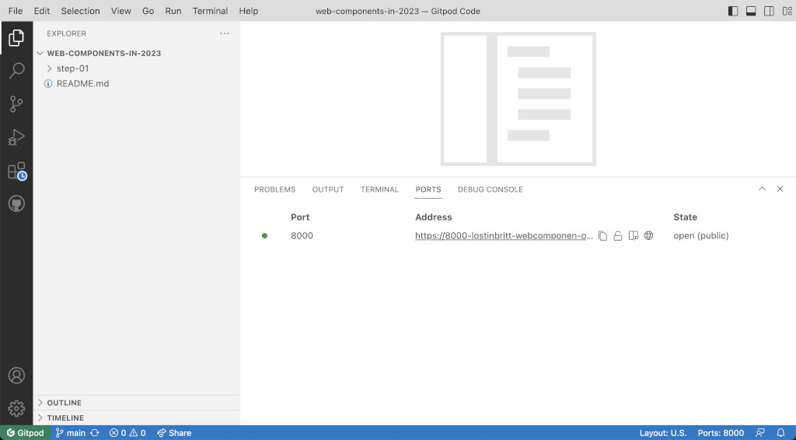
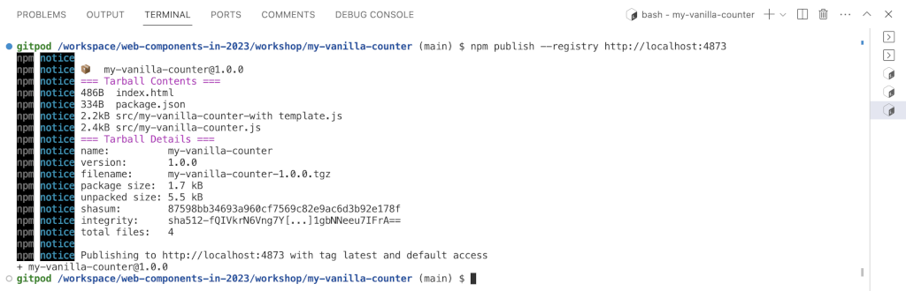

# Web Components in 2023 - Vanilla `my-counter` Element

For most of the examples in this workshop, we are going to build the same element in very different ways. The element is a very simple counter, that can be increased using a button.


## Initializing the step and installing Vite development server

Let's begin by creating a folder `my-vanilla-counter` inside `workshop`. 

Inide `my-vanilla-counter` create two folders: `src` and `src/img`. Copy the web components logo `web-components.png` from the main `assets` folder to `my-vanilla-counter/src/img` and rename it in `logo.png`.

`my-vanilla-counter` is going to be the root folder for this step, from here on all file paths in this step are relative to it.

In order to serve our component, we are simply installing [Vite](https://vite.dev) as development server. 

File `package.json`
```json
{
  "name": "my-vanilla-counter",
  "version": "1.0.0",
  "description": "Vanilla Web Components version of my-counter",
  "scripts": {
    "dev": "vite",
    "build": "vite build",
    "preview": "vite preview"
  },
  "devDependencies": {
    "vite": "^4.4.9"
  }
}
```

And execute:

```bash
npm install
```

You can now use Vite to serve the content of your `my-vanilla-counter` folder:

```bash
vite
```


## Creating `my-vanilla-counter``

Let's see the vanilla version of `my-counter`:

File `src/my-vanilla-counter.js`
```javascript
class MyVanillaCounter extends HTMLElement {
  constructor() {
    super();
    this._counter = 0;
    this.attachShadow({ mode: 'open' });
  }

  connectedCallback() {
    this.render();
    this.display();
  }

  static get observedAttributes() { return [ 'counter' ] }

  // We reflect attribute changes into property changes
  attributeChangedCallback(attr, oldVal, newVal) {
    if (oldVal !== newVal) {
      this[attr] = newVal;
    }
  }

  // Getter and setters for counter
  get counter() { return this._counter; }
  set counter(value) { 
    if (value != this._counter) {
      this._counter = Number.parseInt(value);
      this.setAttribute('counter', value);
      this.display();
    }
  }

  increment() {
    this.counter = this.counter + 1;
    this.dispatchEvent(new CustomEvent('increased', {detail: {counter: this.counter}}));
  }
  render() {
    let container = document.createElement('div');
    container.style.display = 'flex';
    container.style.flexFlow = 'row wrap';
    container.style.justifyContent = 'space-around'; 
    container.style.alignItems = 'center';
    container.style.backgroundColor = '#ffaaaa';
    container.style.padding = '1rem';
    container.style.borderRadius = '0.5rem';
    this.shadowRoot.appendChild(container);

    let button = document.createElement('div');
    button.addEventListener('click', this.increment.bind(this));
    button.style.width = '7rem';
    button.style.height = '7rem';
    button.style.borderRadius = '1rem';
    button.style.margin = '0.5rem';
    button.style.display = 'flex';
    button.style.flexFlow = 'row nowrap';
    button.style.justifyContent = 'center';
    button.style.alignItems = 'center';
    button.style.backgroundColor = '#ddd';
    button.style.cursor = 'pointer';
    button.style.borderWidth = '2px';
    button.style.borderStyle = 'outset';
    button.style.borderColor = 'buttonface';
    
    let logo = document.createElement('img');
    logo.src = `${import.meta.url}/../img/logo.png`;
    logo.style.width = '3rem';
    button.appendChild(logo);

    container.appendChild(button);

    this.output = document.createElement('div');
    this.output.style.margin = '0.5rem';
    container.appendChild(this.output);

    this.style.display = 'block';
    this.style.fontSize = '5rem';
  }

  display() {
    this.output.innerHTML = `${this.counter}`;
  }

}
customElements.define(`my-vanilla-counter`, MyVanillaCounter);
```
To use it, we simply load the JS file as a module, as it has an asset (the logo image) that need to get grabbed. And then, as usual we can use it as any other HTML tag:

File `index.html`
```html
<!DOCTYPE html>
<html>
  <head>
    <title>Vanilla `my-counter`</title>
    <script type="module" src="./src/my-vanilla-counter.js"></script>
  </head>
  <body>
    <h1><code>my-vanilla-counter</code></h1>
    <my-vanilla-counter></my-vanilla-counter>
  </body>
</html>
```

As before, no build process is needed, all is fully native browser web standard. But this time, we are using imports, we can't simply open the file in the browser, we need to launch a web server.

> If you're [running the workshop on GitPod](https://gitpod.io/#https://github.com/LostInBrittany/web-components-in-2023.git), simply execute the `dev` task with npm:
>
> ```bash
> npm run dev
> ```
> [](./img/gitpod-vite-npm-run-dev.png)
> 
> Make the port public, and in the `ports` tab you will find the public URL for your server.
> 
> [](./img/gitpod-public-url.png)
> You can go to that URL and in `/workshop/my-vanilla-counter` you will find your `index.html` file.
 
And you can see `my-vanilla-counter` in action: 

[](./img/my-vanilla-counter.png)


## `my-vanilla-counter-with-template`

All those JavaScript instructions to create the DOM of the custom element are bothersome. Let's apply another of the pillars of the Web Component standard, the templates, to make it easier to write (and read!).

File `my-vanilla-counter-with-template.js`
```javascript
let template = `
<style>
  ...
</style>
<div class="container">
   <div id="icon">
       
   </div>
   <div id="value">
       0
   </div>
</div>
`;

class MyVanillaCounterWithTemplate extends HTMLElement {
  constructor() {
    super();
    this._counter = 0;
    this.attachShadow({ mode: 'open' });
  }

  connectedCallback() {
    this.render();
    this.display();
  }

  static get observedAttributes() { return [ 'counter' ] }

  // We reflect attribute changes into property changes
  attributeChangedCallback(attr, oldVal, newVal) {
    if (oldVal !== newVal) {
      this[attr] = newVal;
    }
  }

  // Getter and setters for counter
  get counter() { return this._counter; }
  set counter(value) { 
    if (value != this._counter) {
      this._counter = Number.parseInt(value);
      this.setAttribute('counter', value);
      this.display();
    }
  }

  increment() {
    this.counter = this.counter + 1;
    this.dispatchEvent(new CustomEvent('increased', {detail: {counter: this.counter}}));
  }
  render() {
    let templ = document.createElement('template');     
    templ.innerHTML = template;

    this.shadowRoot.appendChild(templ.content.cloneNode(true));

    let button = this.shadowRoot.getElementById('icon');
    button.addEventListener('click', this.increment.bind(this));
  }

  display() {
    this.shadowRoot.getElementById('value').innerHTML =
      `${this.counter}`;
  }

}
customElements.define(`my-vanilla-counter-with-template`, MyVanillaCounterWithTemplate);
```

And we can add it to our HTML file:

File `index.html`:
```html
<!DOCTYPE html>
<html>
  <head>
    <title>Vanilla `my-counter`</title>
    <script type="module" src="./src/my-vanilla-counter.js"></script>
    <script type="module" src="./src/my-vanilla-counter-with template.js"></script>
  </head>
  <body>
    <h1><code>my-vanilla-counter</code></h1>
    <my-vanilla-counter></my-vanilla-counter>
    <h1><code>my-vanilla-counter-with-template</code></h1>
    <my-vanilla-counter-with-template></my-vanilla-counter-with-template>
  </body>
</html>
```

In the browser we see now both elements:

[](./img/my-vanilla-counter-with-template.png)


## Publishing in our local registry

> Usually you should have created a user in the local Verdaccio register in the [step 02](../step-02/). If you haven't done, you can do it now: 
> ```bash
> npm adduser --registry http://localhost:4873
> ```

In order to publish our `my-stencil-component` into the local Verdaccio registry, we need to use `npm publish`:

```bash 
npm publish --registry http://localhost:4873
```

  [](./img/gitpod-registry-publish.png)