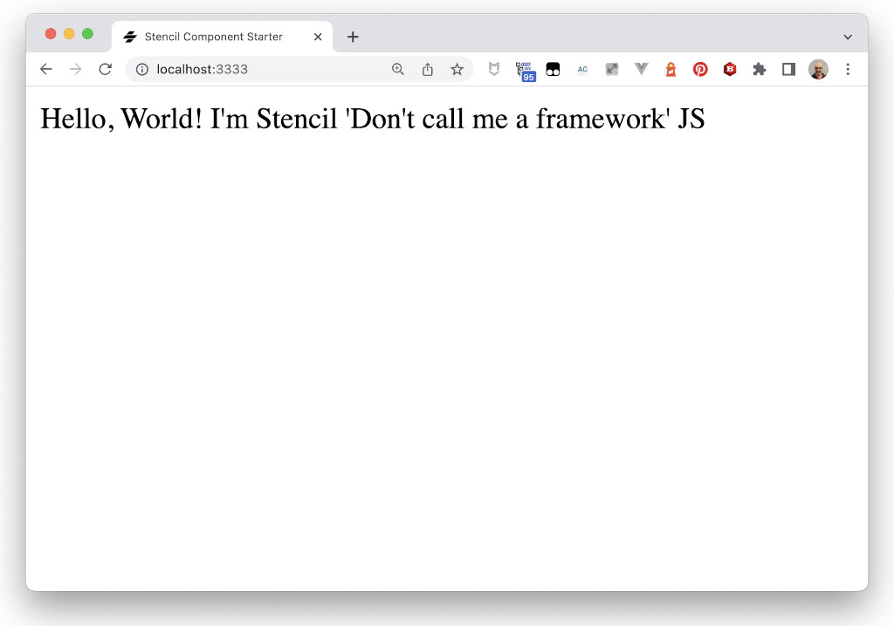

# Web Components in 2023 - Stencil `my-counter` Element

Now we are going to use Stencil to create another version of our counter, `my-stencil-counter`.

> To create Stencil components, we need to use `nodejs` and `npm`. If you don't have them in your computer, the easiest way would be to use the [GitPod workspace](https://gitpod.io/#https://github.com/LostInBrittany/web-components-in-2023.git), that has all the required tooling.

## Creating the project

In the `workshop` folder, create a new stencil project, and call it `my-stencil-counter`:

```bash
npm init stencil
```

Stencil can be used to create standalone components, or entire apps. After running init you will be provided with a prompt so that you can choose the type of project to start. Please choose `component` to create your first Stencil component.


```bash
? Select a starter project.

Starters marked as [community] are developed by the Stencil Community,
rather than Ionic. For more information on the Stencil Community, please see
https://github.com/stencil-community › - Use arrow-keys. Return to submit.
❯   component                Collection of web components that can be used anywhere
    app [community]          Minimal starter for building a Stencil app or website
    ionic-pwa [community]    Ionic PWA starter with tabs layout and routes
✔ Project name … my-stencil-counter
✔ Confirm? … yes
✔ All setup  in 30 ms

  We suggest that you begin by typing:

  $ cd my-stencil-counter
  $ npm install
  $ npm start

  You may find the following commands will be helpful:

  $ npm start
    Starts the development server.

  $ npm run build
    Builds your project in production mode.

  $ npm test
    Starts the test runner.


  Further reading:

   - https://github.com/ionic-team/stencil-component-starter
   - https://stenciljs.com/docs

  Happy coding! 🎈
```

## Starting the development server

As the starter suggest, go to the newly created `my-stencil-counter` folder, and run:

```bash
cd my-stencil-counter
npm install
npm run start
```

Then point your browser to the given URL and you should see your first Stencil component:

```bash
$ npm install
added 417 packages, and audited 418 packages in 35s

36 packages are looking for funding
  run `npm fund` for details

22 moderate severity vulnerabilities

To address issues that do not require attention, run:
  npm audit fix

To address all issues (including breaking changes), run:
  npm audit fix --force

Run `npm audit` for details.

$ npm run start

> my-stencil-counter@0.0.1 start
> stencil build --dev --watch --serve

[12:13.6]  @stencil/core
[12:13.8]  v4.0.1 ⛹
[12:14.9]  build, my-stencil-counter, dev mode, started ...
[12:14.9]  transpile started ...
[12:16.1]  transpile finished in 1.19 s
[12:16.1]  copy started ...
[12:16.1]  generate lazy + source maps started ...
[12:16.1]  copy finished (0 files) in 17 ms
[12:16.3]  generate lazy + source maps finished in 204 ms
[12:16.4]  build finished, watching for changes... in 1.44 s

[12:16.4]  http://localhost:3333/
```

[](./img/hello-stencil.png)

## How does it work?

If you look at the `my-stencil-counter` folder, you will see the structure of a Stencil project. The source code is in the `src` folder:


All the components in this component collection are in the `src/components` folder, each one in its own subfolder. As you can see, we only have a component here, `my-component`.


## Anatomy of a Stencil Component

Each component has two main files, a TypeScript file (`my-component.tsx`in this example) and a CSS one (`my-component.css`). The `.tsx` extension is required since Stencil components are built using [JSX](https://facebook.github.io/react/docs/introducing-jsx.html) and TypeScript.

Let's look at the `my-component.tsx` file:

```tsx
import { Component, Prop, h } from '@stencil/core';
import { format } from '../../utils/utils';

@Component({
  tag: 'my-component',
  styleUrl: 'my-component.css',
  shadow: true,
})
export class MyComponent {
  /**
   * The first name
   */
  @Prop() first: string;

  /**
   * The middle name
   */
  @Prop() middle: string;

  /**
   * The last name
   */
  @Prop() last: string;

  private getText(): string {
    return format(this.first, this.middle, this.last);
  }

  render() {
    return <div>Hello, World! I'm {this.getText()}</div>;
  }
}
```

The first piece we see is the `@Component` decorator. This decorator provides metadata about our component to the Stencil compiler. Information, such as the tag to use, and external styles, can be set here and picked up by the compiler.

Below the `@Component()` decorator, we have a standard TypeScript class. This is where you'll write the bulk of your code to bring your Stencil component to life. Here is where you'd write functions or provide business logic.

In order for the component to render something to the screen, we must declare a render function that returns JSX. If you're not sure what JSX is, don't worry, we'll go over it later in the tutorial.

The quick idea is that our render function needs to return a representation of the HTML we want to push to the DOM.

The name property on the class also has a decorator applied to it, `@Prop()`. This decorator tells the compiler that the property is public to the component, and the user should be setting it. We set this property like so:

```html
<my-first-component name="Max"></my-first-component>
```

Any property decorated with `@Prop()` is also automatically watched for changes. If a user of our component were to change the element's name property, our component would fire its render function again, updating the displayed content.

## The entry point

The `index.ts` file loads 


The `index.html` file is the entry point of the application:

```html
<!DOCTYPE html>
<html dir="ltr" lang="en">
  <head>
    <meta charset="utf-8" />
    <meta name="viewport" content="width=device-width, initial-scale=1.0, minimum-scale=1.0, maximum-scale=5.0" />
    <title>Stencil Component Starter</title>

    <script type="module" src="/build/my-stencil-counter.esm.js"></script>
    <script nomodule src="/build/my-stencil-counter.js"></script>
  </head>
  <body>
    <my-component first="Stencil" last="'Don't call me a framework' JS"></my-component>
  </body>
</html>
```


As you see, it's rather simple: it loads a `my-stencil-counter.esm.js` (or `my-stencil-counter.js` in old browsers) that is generated by Stencil from the source `.ts` files, specially from the main `index.ts` file. This file loads the list of your defined components from the `components` folder.

Your Stencil components, once compiled, can be used in HTML just like any other tag:

```html
    <my-component first="Stencil" last="'Don't call me a framework' JS"></my-component>
```

## Creating `my-stencil-counter`

We are creating now the stencil version of our counter. Let's begin by creating a `my-stencil-counter` folder inside `src/components`. Inside it, create a `my-stencil-counter.tsx` file:

File ``my-stencil-counter/src/components/my-stencil-counter.tsx`
```tsx
import { Component, Prop, State, h } from '@stencil/core';

@Component({
  tag: 'my-stencil-counter',
 )
export class MyStencilContent {
  
  @State()
  counter: number = 0;
}
```

The `@Component` decorator provides metadata about our component to the Stencil compiler. For the moment we have only declared the `tag` property, that will the the custom HTML tag for our component.

*For more information about the `@Component` decorator, see the [official documentation](https://stenciljs.com/docs/component).* 

The `@State` decorator allows us to define an internal variable for the component, the count.

*For more information about the `@State` decorator, see the [official documentation](https://stenciljs.com/docs/state)*


## Rendering the component

Next thing our component need is a `render()` method, that returns a tree of components that are rendered to the DOM at runtime. This `render` method use JSX a popular, declarative template syntax.  

We also need to add a click handler method to increase the count.


File ``my-stencil-counter/src/components/my-stencil-counter.tsx`
```tsx
private handleClick = () => {
  this.counter++;
}

render() {
  return <div class="container">
    <div id="icon" onClick={this.handleClick}>
    </div>
    <div id="value">
        {this.counter}
    </div>
  </div>
}
```

> In order to compile the JSX code, you need to import the `h` function from `@stencil/core`, as we have done when creating the component.

*You can find more information about using JSX in Stencil in the [official documentation](https://stenciljs.com/docs/templating-jsx).*

## Adding some style

Put the CSS into a `my-stencil-counter.css` file in the same folder:

File `my-stencil-counter/src/components/my-stencil-counter.css`
```css
.container {
  display: flex; 
  flex-flow: row wrap; 
  justify-content: space-around; 
  align-items: center; 
  background-color: #c0c0c0; 
  padding: 1rem; 
  border-radius: 0.5rem;
}
#icon {
  width: 7rem; 
  height: 7rem; 
  border-radius: 1rem; 
  margin: 0.5rem; 
  display: flex; 
  flex-flow: row nowrap; 
  justify-content: center; 
  align-items: center; 
  background-color: rgb(221, 221, 221); 
  cursor: pointer; 
  border-width: 2px; 
  border-style: outset; 
  border-color: buttonface;
}
#icon img {
  width: 3rem;
}
#value {
  font-size: 5rem;
}
```

And modify the definition of your component to use it:

File `my-stencil-counter/src/components/my-stencil-counter.tsx`
```tsx
@Component({
  tag: 'my-stencil-counter',
  styleUrl: 'my-stencil-counter.css',
  shadow: true,
})
```

Now we can add the Stencil logo. Copy it from `step-03/img/logo.png`
into `my-stencil-counter/src/components/my-stencil-counter/assets/` and  modify again the definition of your component to use it as assets folder:

```tsx
import { Component, State, getAssetPath, h } from '@stencil/core';

@Component({
  tag: 'my-stencil-counter',
  styleUrl: 'my-stencil-counter.css',
  shadow: true,
  // assetsDirs lists the 'assets' directory as a relative
  // (sibling) directory
  assetsDirs: ['assets']
})
```

And we add the image to the `render()`:

```tsx
  render() {
    return <div class="container">
      <div id="icon" onClick={this.handleClick}>
        </img>
      </div>
      <div id="value">
          {this.counter}
      </div>
    </div>
  }
```

## `my-stencil-component` in action

We can already add a `my-stencil-counter` component to our `index.html` file, and it will be nicely rendered:

File `my-stencil-counter/src/index.html`

```html
<!DOCTYPE html>
<html dir="ltr" lang="en">
  <head>
    <meta charset="utf-8" />
    <meta name="viewport" content="width=device-width, initial-scale=1.0, minimum-scale=1.0, maximum-scale=5.0" />
    <title>My Stencil Counter</title>

    <script type="module" src="/build/my-stencil-counter.esm.js"></script>
    <script nomodule src="/build/my-stencil-counter.js"></script>
  </head>
  <body>
    <my-stencil-counter></my-stencil-counter>
  </body>
</html>
```

And `my-stencil-counter` appears on the browser:

[](./img/my-stencil-counter.png)


## Publishing in our local registry

In order to publish our `my-stencil-component` into the local Verdaccio registry, we need to

1. Create a user, if not already done (usually in the [step 02](../step-02/)):

```bash
npm adduser --registry http://localhost:4873
```

  [](./img/gitpod-registry-add-user.png)

2. Publish the component:

```bash 
npm publish --registry http://localhost:4873
```

  [](./img/gitpod-registry-publish.png)