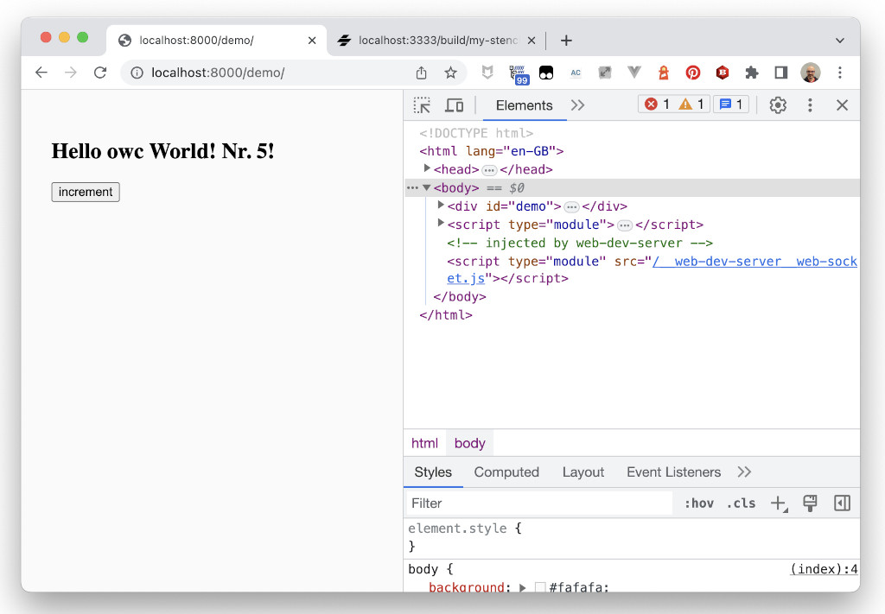

# Web Components in 2023 - Lit `my-counter` Element

Now we are going to use Lit to create another version of our counter, `my-lit-counter`.

> To create Lit components, we need to use `nodejs` and `npm`. If you don't have them in your computer, the easiest way would be to use the [GitPod workspace](https://gitpod.io/#https://github.com/LostInBrittany/web-components-in-2023.git), that has all the required tooling.

## Creating the project

In the `workshop` folder, create a new lit project using Vite Lit generator, and call it `my-lit-counter`:

```bash
npm init my-lit-counter
```

After running init you will be provided with a prompt so that you can choose the type of project to start. Please choose the Lit template to create your first Lit component.

```bash
$ npm init vite
✔ Project name: … my-lit-counter
✔ Select a framework: › Lit
✔ Select a variant: › JavaScript

Scaffolding project in /Users/hgonzale/git/frontend/web-components-in-2023/step-04/tmp/my-lit-counter...

Done. Now run:

  cd my-lit-counter
  npm install
  npm run dev
```


## Starting the development server

As the starter suggest, go to the newly created `my-lit-counter` folder, and run:

```bash
cd my-lit-counter
npm install
npm run dev
```

Then point your browser to the given URL and you should see your first Lit component:

```bash
$ npm run start
  VITE v4.4.9  ready in 256 ms

  ➜  Local:   http://localhost:5173/
  ➜  Network: use --host to expose
  ➜  press h to show help
```

[](./img/hello-lit.png)


## How does it work?

If you look at the `my-lit-counter` folder, you will see the structure of a Lit project is simpler than for Stencil, nothing special here besides the `src` folder for the source files, where we have one component: `my-element.js`:

File `src/my-element.js`
```javascript
import { LitElement, css, html } from 'lit'
import litLogo from './assets/lit.svg'
import viteLogo from '/vite.svg'

/**
 * An example element.
 *
 * @slot - This element has a slot
 * @csspart button - The button
 */
export class MyElement extends LitElement {
  static get properties() {
    return {
      /**
       * Copy for the read the docs hint.
       */
      docsHint: { type: String },

      /**
       * The number of times the button has been clicked.
       */
      count: { type: Number },
    }
  }

  constructor() {
    super()
    this.docsHint = 'Click on the Vite and Lit logos to learn more'
    this.count = 0
  }

  render() {
    return html`
      <div>
        <a href="https://vitejs.dev" target="_blank">
          
        </a>
        <a href="https://lit.dev" target="_blank">
          
        </a>
      </div>
      <slot></slot>
      <div class="card">
        <button @click=${this._onClick} part="button">
          count is ${this.count}
        </button>
      </div>
      <p class="read-the-docs">${this.docsHint}</p>
    `
  }

  _onClick() {
    this.count++
  }

  static get styles() {
    return css`
      :host {
        max-width: 1280px;
        margin: 0 auto;
        padding: 2rem;
        text-align: center;
      }
      [...]
    `
  }
}

window.customElements.define('my-element', MyElement)

```

Let's analyse it together!

Lit components extend a common base classe `LitElement` that includes the syntactic sugar that makes Lit so easy, without requiring any building step:

```javascript
import { LitElement, css, html } from 'lit'
import litLogo from './assets/lit.svg'
import viteLogo from '/vite.svg'
export class MyElement extends LitElement { /* ... */ }
```

The `render()` method function defines your component’s template. You must implement render for every LitElement component. It returns an HTML template object using `lit-html`:

```javascript
 render() {
    return html`
      <div>
        <a href="https://vitejs.dev" target="_blank">
          
        </a>
        <a href="https://lit.dev" target="_blank">
          
        </a>
      </div>
      <slot></slot>
      <div class="card">
        <button @click=${this._onClick} part="button">
          count is ${this.count}
        </button>
      </div>
      <p class="read-the-docs">${this.docsHint}</p>
    `
  }
```

A LitElement usually has properties, instance variables defining its state. Properties are declared in a `properties` static getter, that return the observable properties that cause the element to update.

In our example we have two properties, `title` and `counter`: 

```javascript
  static get properties() {
    return {
      docsHint: { type: String },
      count: { type: Number },
    }
  }
```

Properties and internal variables can be initialized on the constructor:

```javascript 
  constructor() {
    super()
    this.docsHint = 'Click on the Vite and Lit logos to learn more'
    this.count = 0
  }

```

And you can define the styling of your component with the `styles` static getter

```javascript
  static get styles() {
    return css`
      :host {
        max-width: 1280px;
        margin: 0 auto;
        padding: 2rem;
        text-align: center;
      }
      [...]
    `;
  }
```

By default, Lit components use ShadowDOM.


And the component is imported and used in `index.html`.
If we look at it, we see that it uses the `render()` method from Lit to directly generate the HTML and attach it to the document::

File `ndex.html`
```html
<!DOCTYPE html>
<html lang="en">
  <head>
    <meta charset="UTF-8" />
    <link rel="icon" type="image/svg+xml" href="/vite.svg" />
    <meta name="viewport" content="width=device-width, initial-scale=1.0" />
    <title>Vite + Lit</title>
    <link rel="stylesheet" href="./src/index.css" />
    <script type="module" src="/src/my-element.js"></script>
  </head>
  <body>
    <my-element>
      <h1>Vite + Lit</h1>
    </my-element>
  </body>
</html>
```

## Coding `my-lit-counter`

Let's modify our component to make it work as the Vanilla or Stencil ones. Create a `my-lit-counter/src/my-lit-counter.js` file and copy the content of `my-element.js`, changing the references of `MyElement` to `MyLitCounter`.

Let's begin by importing the external asset, i.e. the Lit logo. Copy the Lit logo `lit-js.png` from the main `assets` folder to `my-lit-counter/src/assets/logo.png` and import it.

File `src/my-lit-counter.js`
```js
import logoUrl from './assets/logo.png';
```


For the properties, we only need one, `counter`, that we initialize to 0 in the constructor:

File `src/my-lit-counter.js`
```javascript
  static get properties() {
    return {
      counter: { type: Number },
    };
  }

  constructor() {
    super();
    this.counter = 0;
  }

  __increment() {
    this.counter += 1;
  }

```

The rendering will build the component in a similar way than Stencil, but using `lit-html` instead of JSX. In order to declare an event listener, lit uses the `@attribute` syntax: 

File `src/my-lit-counter.js`
```javascript
  render() {
    return html`
      <div class="container">
        <div id="icon" @click=${this.__increment}>
          
        </div>
        <div id="value">
            ${this.counter}
        </div>
    </div>
    `;
  }
```


And we put the CSS in the `css()` static getter:

```javascript
  static get styles() {
    return css`
      :host {
        display: block;
      }
      .container {
        display: flex; 
        flex-flow: row wrap; 
        justify-content: space-around; 
        align-items: center; 
        background-color: #c0c0c0; 
        padding: 1rem; 
        border-radius: 0.5rem;
      }
      #icon {
        width: 7rem; 
        height: 7rem; 
        border-radius: 1rem; 
        margin: 0.5rem; 
        display: flex; 
        flex-flow: row nowrap; 
        justify-content: center; 
        align-items: center; 
        background-color: rgb(221, 221, 221); 
        cursor: pointer; 
        border-width: 2px; 
        border-style: outset; 
        border-color: buttonface;
      }
      #icon img {
        width: 3rem;
      }
      #value {
        font-size: 5rem;
      }
    `;
  }
```

Now we simply reload the page and  `my-lit-counter` appears on the browser:

[](./img/my-lit-counter.png)


## Publishing in our local registry

In order to publish our `my-stencil-component` into the local Verdaccio registry, we need to

1. Create a user, if not already done (usually in the [step 02](../step-02/)):

```bash
npm adduser --registry http://localhost:4873
```

  [](./img/gitpod-registry-add-user.png)

2. Publish the component:

```bash 
npm publish --registry http://localhost:4873
```

  [](./img/gitpod-registry-publish.png)