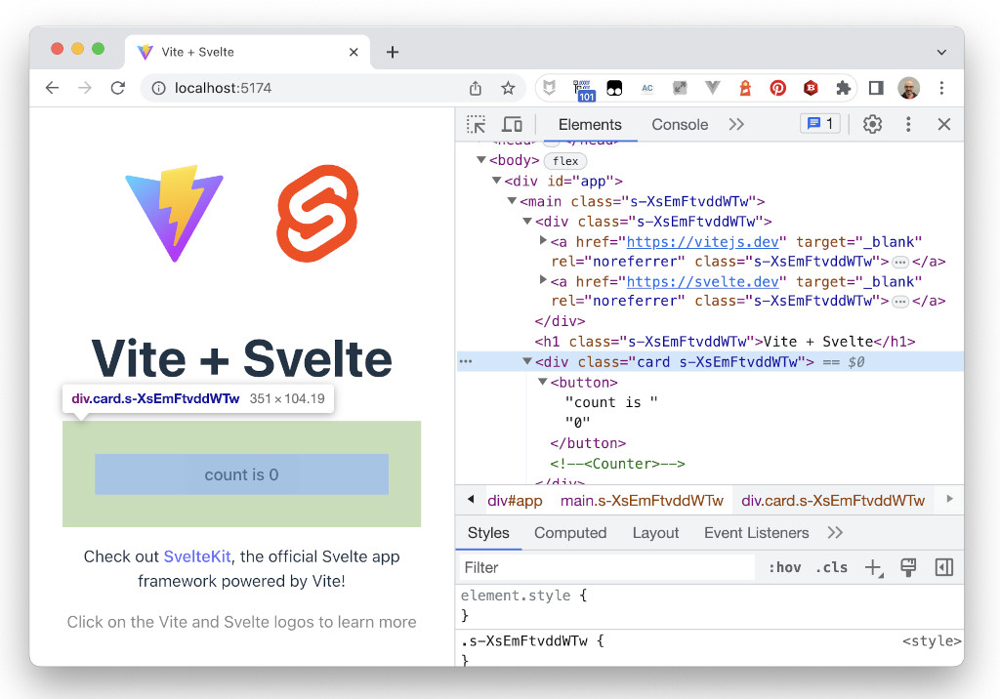
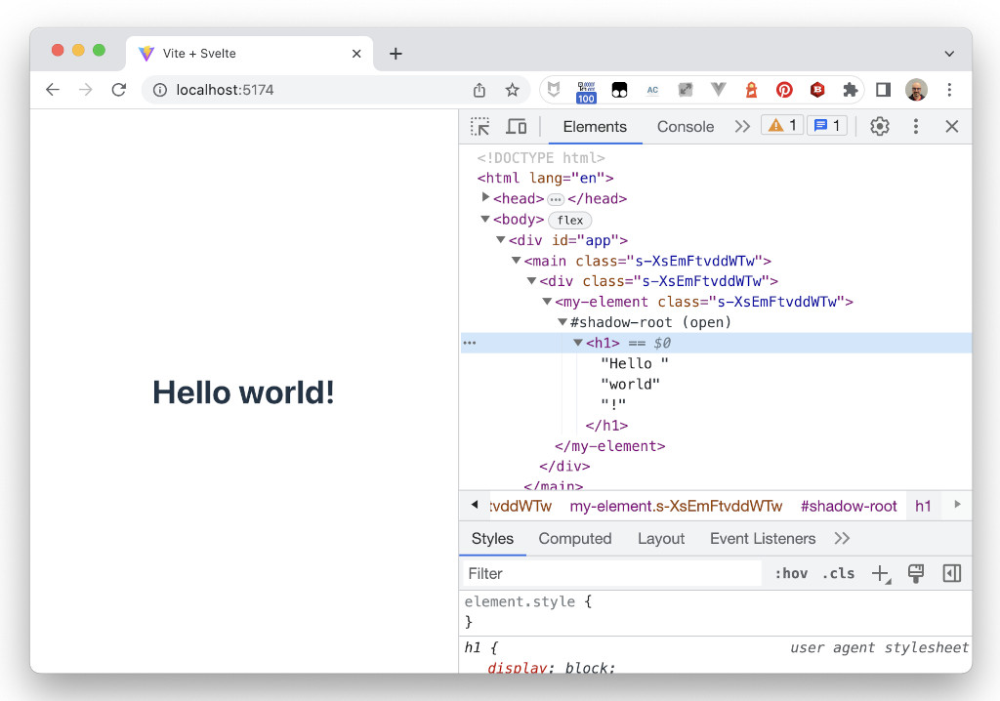
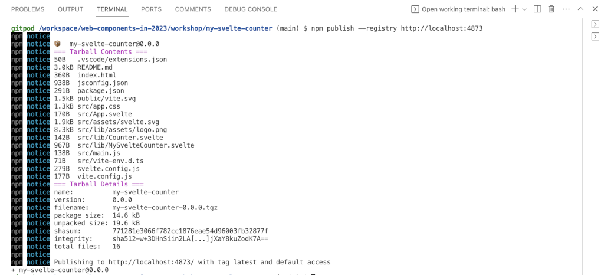

# Web Components in 2023 - Svelte `my-counter` Element

Now we are going to use Svelte to create another version of our counter, `my-svelte-counter`.


> To create Svelte components, we need to use `nodejs` and `npm`. If you don't have them in your computer, the easiest way would be to use the [GitPod workspace](https://gitpod.io/#https://github.com/LostInBrittany/web-components-in-2023.git), that has all the required tooling.


## Creating the project

In the `workshop` folder, create a new Svelte application project using the Svelte generator of Vite, and call it `my-svelte-counter`:


```bash
npm init vite
```
After running init you will be provided with a prompt so that you can choose the type of framework to generate for. Please choose the *Svelte* option:

```bash
$ npm init vite
Need to install the following packages:
  create-vite@4.4.0
Ok to proceed? (y)
✔ Project name: … my-svelte-counter
✔ Select a framework: › Svelte
✔ Select a variant: › JavaScript

Scaffolding project in /Users/hgonzale/tmp/my-svelte-counter...

Done. Now run:

  cd my-svelte-counter
  npm install
  npm run dev
```

## Starting the development server

As the starter suggest, go to the newly created `my-svelte-counter` folder, and run:

```bash
  cd my-svelte-counter
  npm install
  npm run dev
``` 

Then point your browser to the given URL and you should see your Svelte application:

```bash
$ npm install

added 38 packages, and audited 39 packages in 10s

3 packages are looking for funding
  run `npm fund` for details

found 0 vulnerabilities

$ npm run dev

> my-svelte-counter@0.0.0 dev
> vite

Forced re-optimization of dependencies

  VITE v4.4.2  ready in 549 ms

  ➜  Local:   http://localhost:5173/
  ➜  Network: use --host to expose
  ➜  press h to show help
```

[](./img/hello-svelte.png)

## Creating a custom element with Svelte

By default, Svelte compiles everything down to plain old HTML/CSS/JavaScript, no custom elements.

[](./img/svelte-generates-js.png)

In order to make it generate a custom element, we must use the [`customElement: true` compiler option](https://svelte.dev/docs/custom-elements-api).

File `my-svelte-element/svelte.config.js`
```javascript
import { vitePreprocess } from '@sveltejs/vite-plugin-svelte'

export default {
  // Consult https://svelte.dev/docs#compile-time-svelte-preprocess
  // for more information about preprocessors
  preprocess: vitePreprocess(),

  compilerOptions: {
    customElement: true,
  },
}
```

Then we must  specify a tag name for the component using the `customElement` attribute in `<svelte:options>`:

File `my-svelte-element/src/lib/MyElement.svelte`
```svelte
<svelte:options customElement="my-element" />

<script>
  export let name = 'world';
</script>

<h1>Hello {name}!</h1>
<slot />
```

Now we can use the element as a custom element in `App.svelte`:

File `my-svelte-element/src/App.svelte`
```html
<script>
  import MyElement from './lib/MyElement.svelte';

</script>

<main>
  <div>
    <my-element></my-element>
  </div>
</main>

<style>
</style>
```
[](./img/hello-svelte-element.png)


## Creating `my-svelte-counter`

To create `my-svelte-counter` we translate into Svelte syntax our precedent component:

File `my-svelte-element/src/lib/MySvelteCounter.svelte`
```svelte
<svelte:options customElement="my-svelte-counter" />

<script>
  import logo from './assets/logo.png';
  let count = 0
  const increment = () => {
    count += 1
  }
</script>

<div class="container">
  <button id="icon" on:click={increment}>
    
  </button>
  <div id="value">
      {count}
  </div>
</div>

<style>
  .container {
    display: flex; 
    flex-flow: row wrap; 
    justify-content: space-around; 
    align-items: center; 
    background-color: #ffca91; 
    padding: 1rem; 
    border-radius: 0.5rem;
  }
  #icon {
    width: 7rem; 
    height: 7rem; 
    border-radius: 1rem; 
    margin: 0.5rem; 
    display: flex; 
    flex-flow: row nowrap; 
    justify-content: center; 
    align-items: center; 
    background-color: #ffa601; 
    cursor: pointer; 
    border-width: 2px; 
    border-style: outset; 
    border-color: buttonface;
  }
  #icon img {
    width: 3rem;
  }
  #value {
    font-size: 5rem;
  }
</style>
```

And don't forget to copy the Svelte logo `svelte-js.png` from the main `assets` folder to `my-svelte-counter/src/lib/assets/logo.png`.

[](./img/my-svelte-counter.png)

## Exporting `my-svelte-counter`

In order to make the component available outide Svelte, we need to export it. Add this to the `main.js` file:

File `main.js`
```js
export * from './lib/MySvelteCounter.svelte'
```

Now, if we want to create a single file for `my-svelte-counter`, we can use the lib option in our vite config.

File `vite.config.js`:
```js
import { defineConfig } from 'vite'
import { svelte } from '@sveltejs/vite-plugin-svelte'

// https://vitejs.dev/config/
export default defineConfig({
  build:{
    lib:{
      entry: './src/main.js',
      name: 'MyLibrary',
    }
  },
  plugins: [
    svelte({
      compilerOptions: {
        customElement: true,
      },
    }),
  ],
})
```

And beforepublishing, we add the `dist` folder to the folders to be included in the publication by adding a `files` section to the `package.json`:

File `package.json` 
```json
  "files": [
    "dist/"
  ],
```


## Publishing in our local registry

In order to publish our `my-stencil-component` into the local Verdaccio registry, we need to

1. Create a user, if not already done (usually in the [step 02](../step-02/)):

```bash
npm adduser --registry http://localhost:4873
```

  [](./img/gitpod-registry-add-user.png)

2. Remove the `"private": true,` line from the project's `package.json`.

3. Publish the component:

```bash 
npm publish --registry http://localhost:4873
```

  [](./img/gitpod-registry-publish.png)