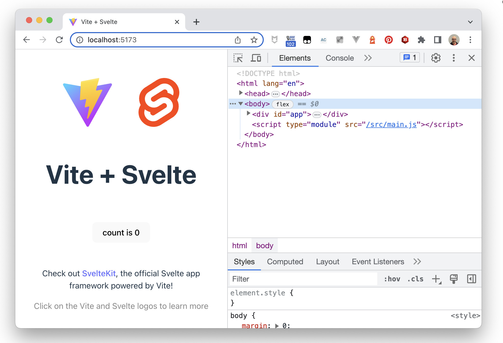

# Web Components in 2023 - Svelte `my-counter` Element

Now we are going to use Svelte to create another version of our counter, `my-svelte-counter`.


> To create Svelte components, we need to use `nodejs` and `npm`. If you don't have them in your computer, the easiest way would be to use the [GitPod workspace](https://gitpod.io/#https://github.com/LostInBrittany/web-components-in-2023.git), that has all the required tooling.


## Creating the project

In the `step-05` folder, create a new Svelte application project using the Svelte generator of Vite, and call it `my-svelte-counter`:


```bash
npm init vite
```
After running init you will be provided with a prompt so that you can choose the type of framework to generate for. Please choose the *Svelte* option:

```bash
$ npm init vite
Need to install the following packages:
  create-vite@4.4.0
Ok to proceed? (y)
✔ Project name: … my-svelte-counter
✔ Select a framework: › Svelte
✔ Select a variant: › JavaScript

Scaffolding project in /Users/hgonzale/tmp/my-svelte-counter...

Done. Now run:

  cd my-svelte-counter
  npm install
  npm run dev
```

## Starting the development server

As the starter suggest, go to the newly created `my-svelte-counter` folder, and run:

```bash
  cd my-svelte-counter
  npm install
  npm run dev
``` 

Then point your browser to the given URL and you should see your Svelte application:

```bash
$ npm install

added 38 packages, and audited 39 packages in 10s

3 packages are looking for funding
  run `npm fund` for details

found 0 vulnerabilities

$ npm run dev

> my-svelte-counter@0.0.0 dev
> vite

Forced re-optimization of dependencies

  VITE v4.4.2  ready in 549 ms

  ➜  Local:   http://localhost:5173/
  ➜  Network: use --host to expose
  ➜  press h to show help
```

[](./img/hello-svelte.png)

